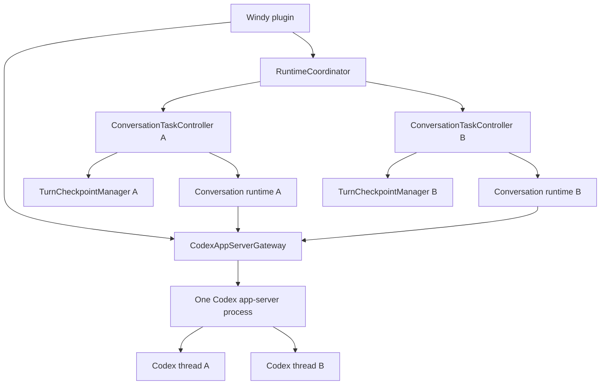

# Windy architecture

Windy separates page navigation, persisted conversations, task
coordination, and provider execution so page changes never own or cancel agent
work.

## Runtime ownership

The plugin owns one `CodexAppServerGateway` for the lifetime of the Vault
plugin instance. The gateway owns the child process, RPC transport, launch
configuration, and process generation.

Each conversation owns a lightweight `CodexChatRuntime`. It retains
conversation-specific thread, turn, prompt, approval, and stream state, but
does not own a child process.

`RuntimeCoordinator` is only the registry and aggregate activity boundary. A
per-conversation `ConversationTaskController` owns send, FIFO queueing,
provider steering, cancel, approval, and recovery state. Its
`TurnCheckpointManager` owns partial-output persistence and
interruption checkpoints. Concurrent requests to initialize the same
conversation share one controller and one runtime.

The gateway broadcasts notifications to active conversation runtimes. Each
runtime accepts only notifications matching its current `threadId` and
`turnId`. Server-initiated requests are dispatched to exactly one runtime by
`threadId`.

## Lifecycle invariants

- Persisted conversation count does not determine child-process count.
- Page navigation changes the visible route but does not dispose a running
  conversation runtime.
- Plugin unload first cancels conversation work, then shuts down the shared
  gateway.
- A gateway restart increments its generation. Every conversation runtime
  observes that generation and resumes its persisted Codex thread in the new
  app-server process before starting another turn.
- Conversation runtime cleanup removes its gateway subscriptions without
  shutting down the shared process.

## Storage invariants

- Conversation files use a versioned envelope under
  `.windy/conversations/<id>.json`. Legacy unversioned conversation files are
  read without modification, version 1 envelopes remain readable, and both are
  upgraded to the current schema on their next normal save.
- Existing JSON files are updated through Obsidian's atomic `process` API. New
  files are written to a unique sibling temporary file and renamed into place.
- Startup reconciliation removes page-index references only when the referenced
  conversation file is definitely missing. Read failures and unreferenced
  conversation files are preserved for recovery instead of being deleted.
- A non-terminal turn persists its user and assistant message ids, source page,
  status, and timestamps. On plugin restart, `running`, `waiting-approval`,
  and `waiting-input` states become `interrupted`; partial assistant output
  remains visible and the lost live turn is never presented as still running.
- Every terminal assistant turn persists its final status and elapsed time.
  These optional message fields remain backward-compatible with conversations
  written before activity summaries were introduced.
- Model and reasoning selections belong to the conversation as concrete
  values. A new draft resolves the global policies against the live Codex
  model catalog, and its first send persists that resolved pair. Missing
  legacy values are materialized from the previously persisted behavior.
- Additional page references belong to the user turn that attached them. Their
  Vault paths are persisted with the message and encoded as `<context_files>`;
  note bodies are read by the agent on demand instead of being copied wholesale
  into every prompt.
- Local file attachments also belong to the user turn. For files with a source
  path, Windy stores only metadata and a path reference: Vault files use
  Vault-relative paths and external files use absolute paths. Missing or moved
  files remain in history as unavailable references.
- Clipboard images have no durable source path, so Windy content-addresses and
  writes their bytes under `.windy/attachments` before storing the same
  Vault-relative attachment reference used by dragged images.
- Codex-compatible image attachments are sent as native local-image input.
  Other file types are sent as provider file mentions and remain available for
  agent tools to inspect from their original location.

## Current boundaries

- `src/page-context`: active page detection and page-to-conversation routing.
- `src/page-context/PageConversationService`: page-scoped history summaries,
  lazy first-send creation, and conversation selection.
- `src/page-context/PageReferenceService`: searchable Markdown and Bases page
  references for composer mentions.
- `src/conversations`: persisted conversation content and provider session
  metadata.
- `src/models`: provider-neutral model-selection contracts consumed by UI.
- `src/providers/codex/CodexConversationModelService`: live Codex model
  discovery, validation, and conversation-level selection.
- `src/runtime/RuntimeCoordinator`: task registry, event forwarding, and global
  background status.
- `src/runtime/ConversationTaskController`: one conversation's live task
  lifecycle.
- `src/runtime/TurnCheckpointManager`: partial turn persistence and interruption
  recovery.
- `src/providers/codex/runtime`: Codex protocol, shared process gateway, and
  per-conversation runtime state.
- `src/ui/MessageListRenderer`: lifecycle-scoped Markdown, reasoning, and tool
  presentation. Completed assistant messages use Obsidian's native Markdown
  renderer; live output remains plain text until the turn stops.
- `src/ui/FileAttachmentControl`: unrestricted local-file selection, drag and
  drop, attachment chips, path normalization, and duplicate suppression.
- `src/ui`: remaining Obsidian presentation and user interaction.

Future storage and UI work should preserve these ownership boundaries.
The active-turn rate, persistence, and terminal-state contracts are specified
in [Windy streaming architecture](./STREAMING_ARCHITECTURE.md).
