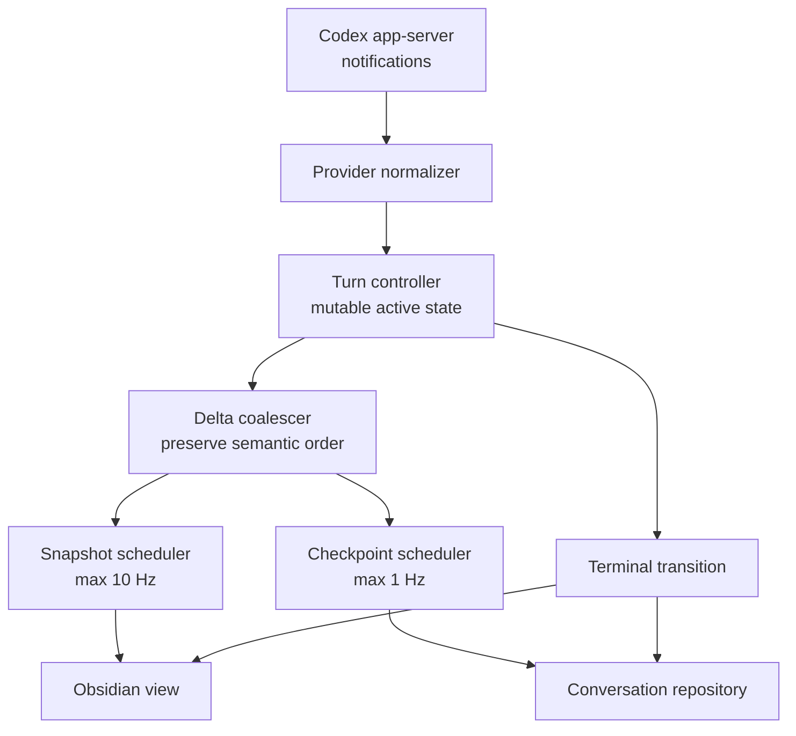

# Windy streaming architecture

## 1. Overview

Windy must present Codex work inside Obsidian without making the provider wait
for UI rendering or progress persistence. The streaming path therefore treats
provider events, durable conversation state, UI snapshots, and checkpoints as
separate concerns with explicit rate and reliability contracts.

This design covers active-turn streaming. It does not change Codex model
selection, tool semantics, conversation history compatibility, or the final
answer format.

## 2. Current state

The original path applied every provider delta directly to the persisted
conversation, cloned the full conversation for a snapshot, rebuilt the full
Windy view, and attempted a full JSON checkpoint every 250 milliseconds.

Observed on a long-running local conversation:

- 21,854 assistant text characters were represented by 13,079 content blocks.
- One final answer arrived as 478 text deltas averaging two characters each.
- The Windy conversation document reached 2.7 MiB.
- Codex reported completion 28.9 seconds before Windy reported completion.

The delay is local queue drain time, not model execution time.

## 3. Technical design

### 3.1 Provider ingestion

Provider notification handlers normalize protocol events into provider-neutral
`StreamChunk` values. Ingestion must not await view rendering or progress
checkpoint I/O. Buffered chunks are drained in batches rather than with
repeated `Array.shift()` operations.

### 3.2 Active-turn state

`ConversationTaskController` remains the owner of mutable active-turn state.
Adjacent `text` and `thinking` deltas are appended to the latest compatible
content block. A tool, context-compaction, or different block type creates a
semantic boundary, so activity order remains lossless.

The accumulated assistant `content` remains the final answer source. Ordered
`contentBlocks` remain the activity source; they store semantic segments rather
than transport packet boundaries.

### 3.3 Snapshot scheduling

Progress snapshots are coalesced to at most one update every 100 milliseconds.
This bounds full-conversation cloning and current full-view rendering to 10 Hz.
Approval, user-input, cancellation, failure, and terminal transitions bypass
the scheduler and emit immediately.

The current full-view renderer is retained in the first implementation phase.
A keyed incremental renderer is a follow-up optimization behind the same
snapshot contract.

### 3.4 Checkpoint scheduling

Progress checkpoints are best-effort recovery data:

- schedule at most once every 1,000 milliseconds;
- never await a progress checkpoint in the chunk-consumption loop;
- preserve invocation order in the repository write queue;
- do not fail the active turn when a progress checkpoint fails.

The terminal save is authoritative and remains awaited before the turn is
reported as durably complete.

### 3.5 Terminal behavior

Terminal state cancels any pending progress snapshot and emits the latest state
immediately. The final save contains all coalesced content, tool results, usage,
provider session metadata, duration, and terminal status.

## 4. Alternatives

| Option | Advantages | Disadvantages | Decision |
|---|---|---|---|
| Persist and render every delta | Simplest state flow | Unbounded local work; provider completion can sit behind UI and I/O backlog | Rejected |
| Debounce until streaming stops | Minimal updates | UI appears frozen during long generations | Rejected |
| Rate-limited snapshots and checkpoints | Bounded cost; preserves live progress and recovery | Full renderer still has a bounded recurring cost | Selected |
| Immediate keyed incremental DOM rewrite | Best theoretical UI efficiency | Couples a state-machine change with a high-risk view rewrite | Follow-up phase |

## 5. Implementation plan

### Phase 1: bound the streaming hot path

- Coalesce adjacent content deltas.
- Rate-limit progress snapshots to 100 milliseconds.
- Make one-second progress checkpoints non-blocking.
- Drain provider buffers in batches.
- Keep all state transitions and final persistence immediate and reliable.

### Phase 2: incremental transcript rendering

- Keep the Windy shell, header, history control, and composer mounted.
- Reconcile messages by stable message id.
- Patch only the active assistant content and current activity item.
- Render terminal Markdown once when the turn completes.

## 6. Acceptance criteria

- Codex `task_complete` to Windy terminal-state delay is below one second for a
  1,500-delta turn on a 3 MiB conversation.
- Five hundred synchronous text deltas produce no more than five observable
  runtime snapshots before terminal completion.
- Adjacent text or thinking packets produce one semantic content block.
- Progress checkpoint latency does not block provider chunk consumption.
- Approval, user-input, cancellation, error, and completion states remain
  immediately observable.
- Interrupted-turn recovery retains all content present at the latest completed
  checkpoint.
- `npm run typecheck && npm test && npm run build` passes.
